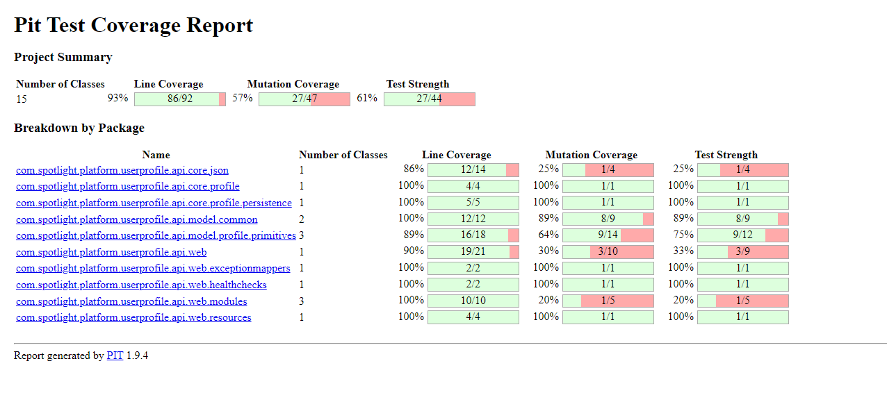

## Dear Gabriel
Hope you are having fun in your farm

This is a little document for me to keep track of my steps and progress.
Normally I would let this be in a private document but since you are taking care of so many mountain goats I think it will help
you understand my process better (maybe even have some constructive tips to improve it).

## First read

So I took a look at the readme and the project and what I gathered these things

* A post api that receives a list of json commands (for batch reception) 
* We need a java class to "map" the command 
* Each command logic will be done in a separate function to ensure the simplicity of other commands
* CQRS pattern? 
* DaoInMemory in a map noted
* Test coverage is at 100% class 
* Good to consider adding mutation tests to ensure we keep that percentage 
* Gabriel did such a great job

## Mutation tests
I learned how to integrate mutation tests in gradle for you Gabriel. I hope you are proud of this 
achievement like I am.

### Your own mutation test results

#### Let's start

First I created the command structure : this is how we will map our json command into an object for manipulation.

I created the base structure for the endpoint and the three functions where I will implement the command 
processing logic. 

The endpoint accepts multiple commands so i probably will need to consider how i will ensure the handling of correct and incorrect
commands (bad types or bad user id).

For now this will do. My next step is going to be implementing tests to get a better vision of how the logic will look like. 

### Moving to tests

I have implemented some tests to demonstrate how the wanted processing of commands will be.

Doing these tests i realised there are some problem cases that need to be handled :
* Case of incorrect command type
* Case of invalid User Id in the command 
* What should we do in the case of correct command but properties that do not exist (accept the command and add the property or count the command as invalid) will send an email tomorrow to inquire.

Since these are things that are handled in the resource I will write integration tests for that regard